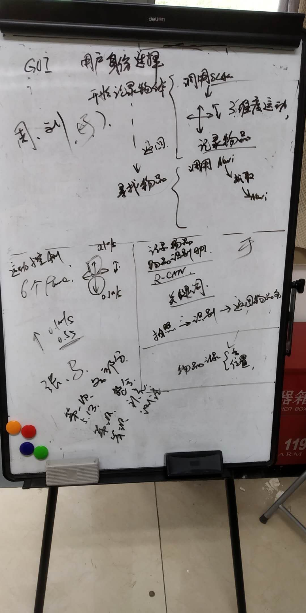

# 软件工程会议记录

**Team 104**

##### 6.2 

出席：刘逸，马力，于金泽，周美廷

交流测试进展

###### 测试进展

- 文档：进度基本正常

  于金泽，刘逸：
1. 关键词查询 FindKeyword+
2. 航点保存 AddNewWaypoint
3. 语音说话 Speak
4. 抓取 GrabSwitch GrabResultCallback 
5. 递给 PassSwitch PassResultCallback
6. Yu 语音识别 KeywordCB
7. Yu 图片获取 ProcColorCB
8. 状态转换 main(FSM)+
9. Yu 图片识别API测试
10. Yu 图片识别结果与可靠性测试
11. GUI、运动控制接口
12. GUI、FSM接口
13. FSM和图像识别接口
14. 运动控制测试+

- 代码：进度基本正常

  周美廷：
1. shopping.cpp == main.cpp
2. 在main.cpp我加了一个函数调用来调用GUI的函数，所以不需要分开跑了
3. 执行命令现在变为 roslaunch rosvis rosvis.launch，这已经可以执行shopping和gui了
4. rviz关掉

##### 5.13 

出席：刘逸，马力，于金泽，张金源，周美廷

交流开发进展，在机器人上进行调试

###### 开发进展

- GUI：进度基本正常

  周美廷，刘逸：完成GUI部分的绘制，GUI部分能够执行显示出界面，按钮能够产生功能

- 运动控制：进度延误

  马力，张金源：完成对运动速度进行调节的代码，但没有实现连续控制中的速度转换等

- 物品识别：开发进度正常，测试进度延误

  于金泽：完成图片物体识别功能，并与ROS控制流程衔接，在控制流程中进行调用、返回关键字、设定锚点，上机测试完成

  ​	完成从机器人的kinect摄像头获取图片的功能，但由于完成时间较晚、机器占用等原因没有上机测试

##### 5.10

出席：马力，于金泽，张金源

临时短会，交流工作目标与实现方法

##### 5.8

出席：刘逸，马力，于金泽，张金源，周美廷

传达上次会议的内容，交流，布置工作目标

##### 5.6

出席：马力，于金泽，张金源

进行中段总结与反思课之前的准备，总结问题，并对上一周（五一期间）的代码阅读、代码编写工作进行交流，交流示例项目代码阅读体会、目标项目代码实现想法，纠正工作重心，明确工作目标与迭代计划，进行分工

##### 4月23日

当前分工：

- 刘逸：		物品抓取
- 于金泽：	语音识别
- 周美廷：	GUI，数据库
- 马力：		导航，SLAM，路径规划
- 张金源：	导航，SLAM，路径规划

流程图：

- 重新规划流程图并加上物品抓取功能
- 考虑如何处理突然出现障碍（停止等待或绕开）
- 添加语音识别功能

数据库设计：
加上数据库模块用来存储物品和地图信息，使用机器人时会调用数据库的信息
需要存的信息：

- 用户信息
- 地图
- 日志
- 物品信息
- 关键词

类图重画

任务：

- 4月25日完成类图和相关内容填写
- 安装Ubuntu和ROS系统
- 4月26日7点开会

